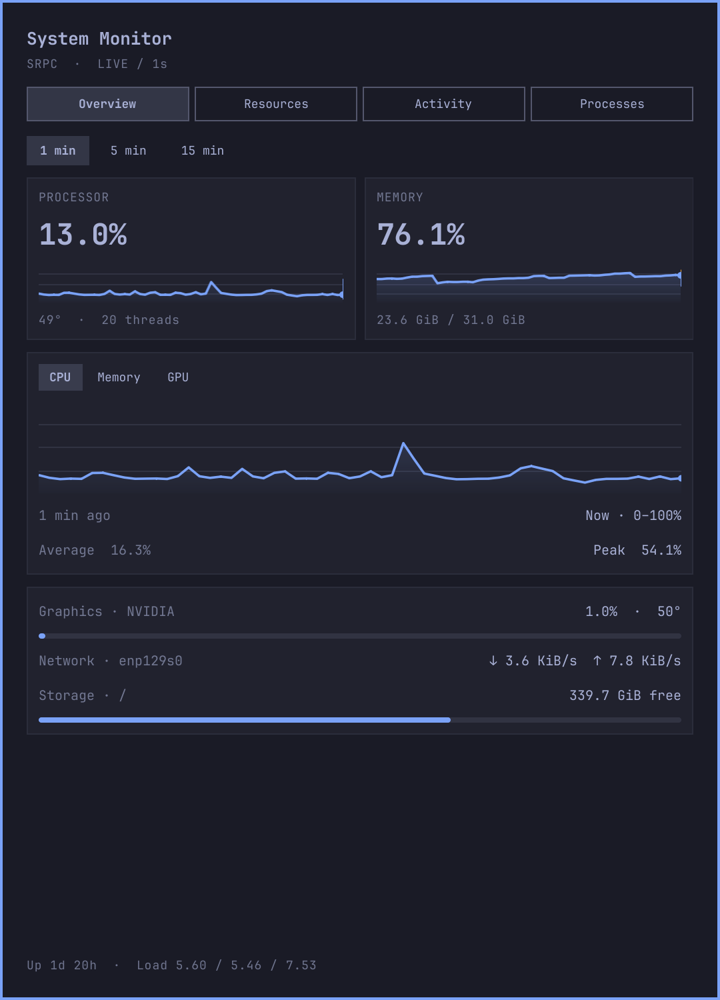
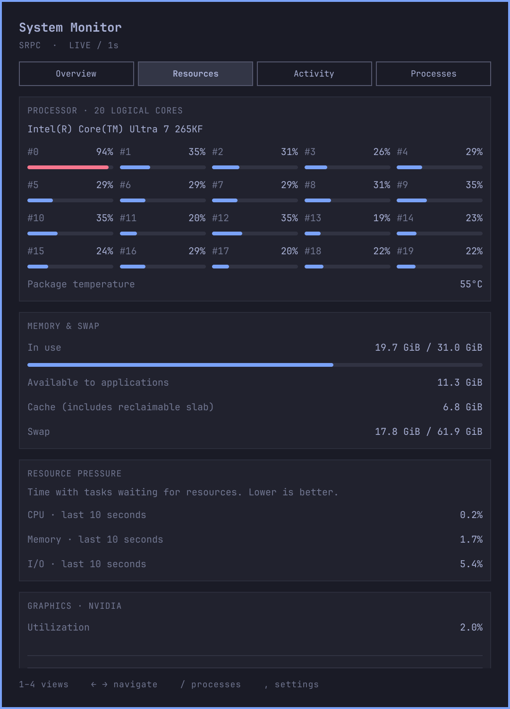
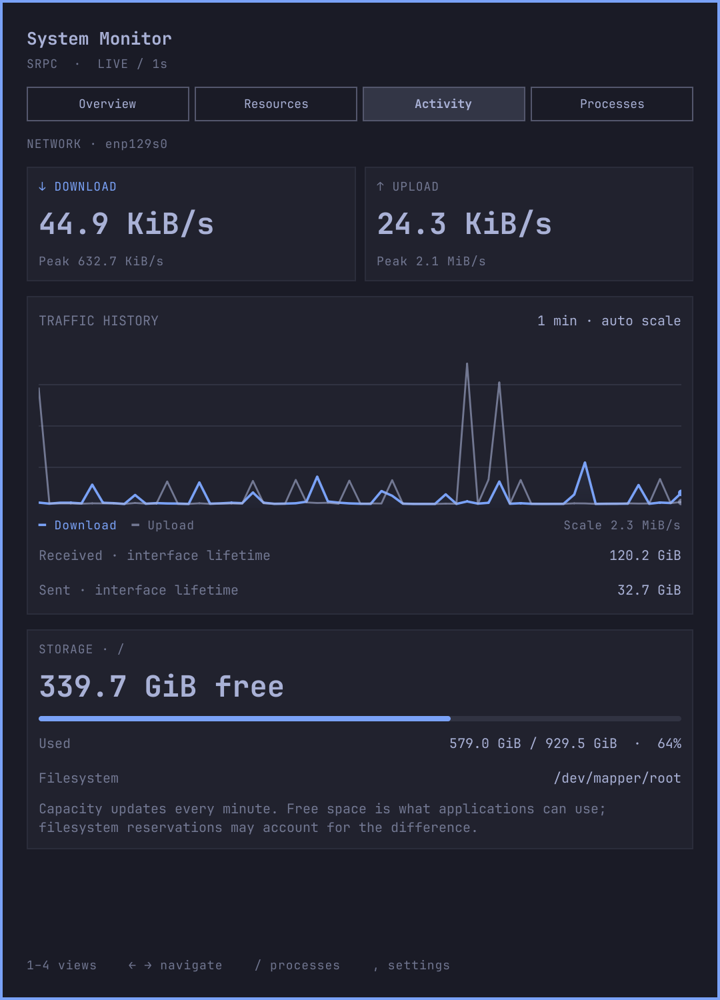
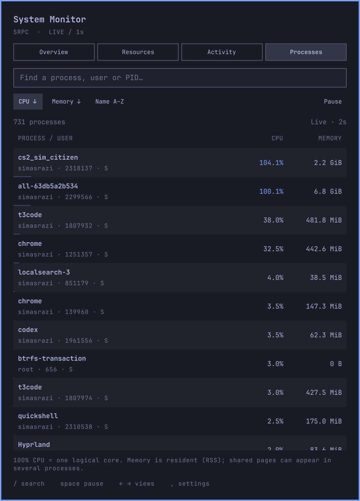
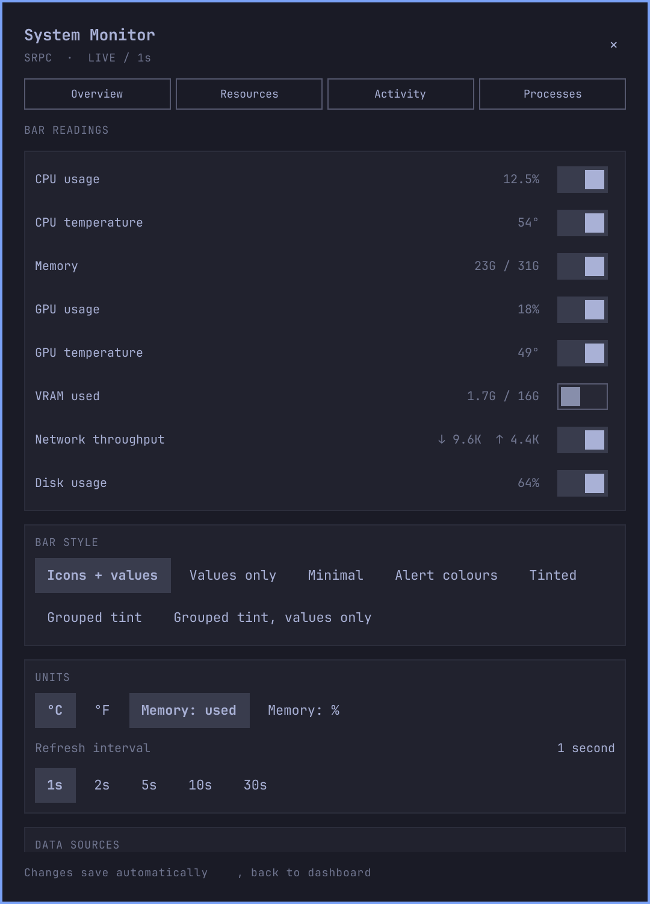
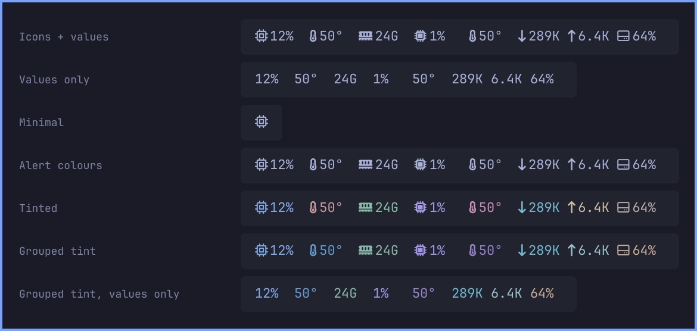

# System Monitor for Omarchy

A compact bar widget that opens into a live system dashboard. See what is busy,
what changed, and which processes are responsible — without leaving your desktop.



| Resources | Activity | Processes | Settings |
| --- | --- | --- | --- |
| [](docs/resources.png) | [](docs/activity.png) | [](docs/processes.png) | [](docs/settings.png) |

## The dashboard

- **Overview:** current CPU and memory, GPU, network, storage, uptime and
  load averages. Switch the detailed chart between
  CPU, memory and GPU, with **1, 5 or 15 minutes** of history and hover readouts.
- **Resources:** every logical CPU, package temperature, available memory,
  reclaimable cache, swap, GPU/VRAM, and CPU/memory/I/O pressure.
- **Activity:** download/upload rates, auto-scaled traffic history (hover for
  both rates at a moment), interface lifetime totals, and storage usage/free
  space for the selected mountpoint.
- **Processes:** live CPU and resident memory, PID, user and state. Search by
  name/user/PID, sort by CPU/memory/name, or pause the list to inspect it. The
  list keeps your scroll position as it refreshes.
- **Settings:** choose bar chips, bar style, units, refresh interval, interface and
  mountpoint. Changes use the same settings as Omarchy's plugin settings screen.

The design takes cues from [btop](https://github.com/aristocratos/btop),
[htop](https://htop.dev/), [Glances](https://nicolargo.github.io/glances/), and the
[Trading212 plugin](https://github.com/simasrazinskas/omarchy-trading212-plugin).
See [design and measurement notes](docs/design.md) for the reasoning.

## Install

```bash
omarchy plugin add https://github.com/simasrazinskas/omarchy-sysmon-plugin.git --enable
```

Place it with `omarchy bar move io.github.simasrazinskas.sysmon`, or drag it
along the bar. Requires Omarchy's Quickshell-based shell. **Python 3** is used
only for the Processes view; other readings work without it. No pip packages,
background daemon, elevated privileges or remote service are needed.

## Controls

Click the bar widget to open the dashboard. The gear opens settings.

| Key | Action |
| --- | --- |
| `1`–`4` | Overview / Resources / Activity / Processes |
| `←` / `→` or `h` / `l` | Previous / next view |
| `↑` / `↓` or `k` / `j` | Scroll the view |
| `/` | Open Processes and focus search |
| `Space` / `Enter` | Pause/resume the process list |
| `,` | Toggle settings |
| `Esc` | Leave a text field; otherwise close the panel |
| `Tab` / `Shift+Tab` | Switch to the next/previous Omarchy panel |

## Bar and settings

Bar readings keep a fixed width, so changing numbers do not move neighboring
widgets. Vertical bars stack values. Switching off every reading leaves a
clickable icon, and unavailable hardware never produces a misleading zero.

Choose a bar style under Settings → Bar style:



| Style | Shows |
| --- | --- |
| Icons + values | The default: an icon next to each reading |
| Values only | Readings without icons |
| Minimal | A single icon; the readings stay in the tooltip |
| Alert colours | Theme colour until a reading is high, then amber (warning) or your theme's urgent colour (critical) |
| Tinted | A slight, distinct hue per metric |
| Grouped tint | A hue family per device: CPU usage azure / CPU temp ocean blue, GPU violet / plum / orchid, network teal / seafoam, memory green, disk amber |
| Grouped tint, values only | Grouped tint without icons — colour already says which reading is which |

Tints are mixed into your theme's bar colour rather than replacing it, so they
stay subtle on light and dark themes.

Alert thresholds (warning / critical) are shared by the bar's alert style and
the dashboard's meters and charts, so they never disagree:

| Reading | Warning | Critical |
| --- | --- | --- |
| CPU, GPU, per-core | ≥75% | ≥90% |
| Memory, VRAM | ≥80% | ≥92% |
| CPU/GPU temperature | ≥75°C | ≥90°C |
| Disk | ≥85% | ≥95% |

| Setting | Default |
| --- | --- |
| CPU, memory, CPU temperature, GPU, GPU temperature, network, disk chips | On |
| VRAM chip | Off |
| Bar style | Icons + values |
| Memory shown as | Used bytes (or percent) |
| Temperature | Celsius (or Fahrenheit) |
| Refresh interval | 2 seconds; configurable from 1–30 |
| History window / chart metric | 1 minute / CPU |
| Network interface | Automatic: follows the default route |
| Disk mountpoint | `/` |

Network auto-detection runs every 30 seconds. Switching interfaces resets rate
baselines and clears old traffic from history. A named interface that doesn't
exist shows "not found" rather than zero traffic. Storage always follows the
configured path, not whichever drive happens to be largest. Text settings save
on Enter or when you leave the field, only if the value changed; `Esc`
restores the saved value. Sensor discovery uses hwmon names and prefers
package-wide CPU readings.

## Reading the numbers

- **Memory:** used = total − `MemAvailable`. Reclaimable cache is not all treated
  as used memory. The cache row includes `Cached + SReclaimable`.
- **Process CPU:** 100% means one fully occupied logical core. A multithreaded
  process can exceed 100%. CPU needs two observations; the first shows `—`.
- **Process memory:** RSS, including shared pages. Adding rows does not equal
  total used memory. Process names come from the kernel's `comm` field and can
  be truncated by the kernel; command arguments are not read.
- **Pressure:** the percentage of time with tasks waiting for CPU, memory or
  I/O over the kernel's recent ten-second window. Unsupported kernels show
  “Not supported.” See [Linux PSI documentation](https://docs.kernel.org/accounting/psi.html).
- **History:** up to 15 minutes in memory, collected while the shell runs.
  It starts empty after reload. CPU/memory/GPU charts use a fixed 0–100% scale;
  network auto-scales. Missing readings and long sampling gaps break the line.
- **Traffic totals:** cumulative counters for the selected interface since it
  was created/reset, not monthly usage or totals since opening this panel.
- **Storage:** `df -Pk`; free space is space available to applications, which
  can exclude reserved blocks. Capacity updates once a minute.

## Sampling and overhead

| Data | Source | Frequency |
| --- | --- | --- |
| CPU/per-core, memory, temperature, network, pressure, load, uptime | In-process `/proc` and `/sys` file reads | Refresh interval |
| GPU | `nvidia-smi` or sysfs backend | At least 5 seconds |
| Storage capacity | `df -Pk` | 60 seconds |
| Processes | Small standard-library Python procfs reader | At least 2 seconds, **only while Processes is open** |
| Route / unavailable hardware retry | `ip route`, sensor/GPU probes | 30 seconds |

The history buffer is capped at 901 samples. Closing the panel unloads its
views and charts. Process snapshots have a five-second timeout and never scan
application files or request privileged access. Pausing freezes the displayed
list while sampling continues. On multi-monitor setups, Omarchy instantiates
one service per bar surface.

## Hardware support

CPU, memory, network and storage work on Linux. GPU backends are selected in
NVIDIA → AMD → Intel order; unavailable backends are retried so driver resets
or reconnects can recover. Only the first readable GPU is displayed.

| Backend | Support |
| --- | --- |
| NVIDIA | `nvidia-smi`; tested on RTX 5070 Ti |
| AMD | `amdgpu` sysfs; not verified on physical AMD hardware |
| Intel | `gpu_busy_percent` where exposed; not verified on physical Intel hardware. Most i915 systems lack this reading and show unavailable |

With no readable GPU, the dashboard says so instead of drawing an empty
chart. Missing sensors remain unavailable. Battery, fan speeds, per-disk I/O,
process termination, process trees and persistent history are not included.

## Development

```bash
./tests/run         # JS/Python regression tests + manifest validation
./tests/qml-smoke   # Native live-data checks; requires installed Omarchy/Quickshell
./tests/screenshots # Regenerate docs/*.png from live readings (~90 s)
```

Keep the smoke test's rendered frames with
`SYSMON_CAPTURE_DIR=/tmp/sysmon-preview ./tests/qml-smoke`. For a quick
screenshot preview, use `SYSMON_WARMUP=5 ./tests/screenshots /tmp/shots`.

| File | Role |
| --- | --- |
| `Panel.qml` | Entry point: bar button, popup, keyboard routing, saving settings |
| `Service.qml` | Samples the machine; GPU backends live in `*Backend.qml` |
| `Dashboard.qml` | Popup frame: heading, tabs, active view, footer |
| `views/` | One file per tab, plus settings |
| `components/` | Shared UI: `BarReadings` (the bar itself), charts, cards, theme |
| `Model.js` | Bar logic: chips, styles, thresholds, compact formatting, tooltip |
| `Metrics.js` | Kernel parsing and dashboard maths |
| `scripts/processes.py` | One read-only procfs snapshot for the Processes view |

`Model.js` and `Metrics.js` are pure and Node-tested.

## License

MIT
